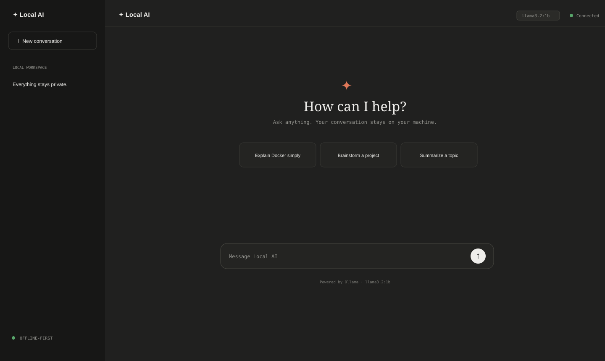

# Local AI Chat



A minimal local chat web app that replaces the n8n chat interface with a clean ChatGPT/Claude-style UI backed by Ollama.

## Requirements

- Node.js 18+
- Ollama installed and running locally
- The `llama3.2:1b` model

## Setup

```bash
ollama pull llama3.2:1b
npm install
npm start
```

Open [http://localhost:3000](http://localhost:3000).

Copy `.env.example` to `.env` to change the port, Ollama URL, or model:

```env
PORT=3000
OLLAMA_URL=http://127.0.0.1:11434
OLLAMA_MODEL=llama3.2:1b
```

For development with Node’s built-in file watcher:

```bash
npm run dev
```

## Project structure

```text
local-ai-chat/
├── server/server.js    # Express API and Ollama proxy
├── public/index.html   # Chat markup
├── public/style.css    # Responsive light/dark UI
├── public/app.js       # Chat behavior and Markdown rendering
├── .env.example        # Local configuration template
└── docs/               # Architecture, About, and release notes
```

## How it works

The browser sends messages only to Express. Express forwards them to Ollama and returns `{ "reply": "..." }`. Ollama is never called directly by the frontend. Each page refresh starts a clean conversation; starter prompts rotate automatically.

## Troubleshooting

- **Unable to connect:** confirm Ollama is running with `ollama serve`.
- **Model not found:** run `ollama pull llama3.2:1b` or set `OLLAMA_MODEL` in `.env`.
- **Port in use:** change `PORT` in `.env`.
- **Slow responses:** the backend waits up to 45 seconds before returning a friendly timeout error.

See [ABOUT.md](ABOUT.md), [docs/architecture.md](docs/architecture.md), [docs/release.md](docs/release.md), and [CHANGELOG.md](CHANGELOG.md).
